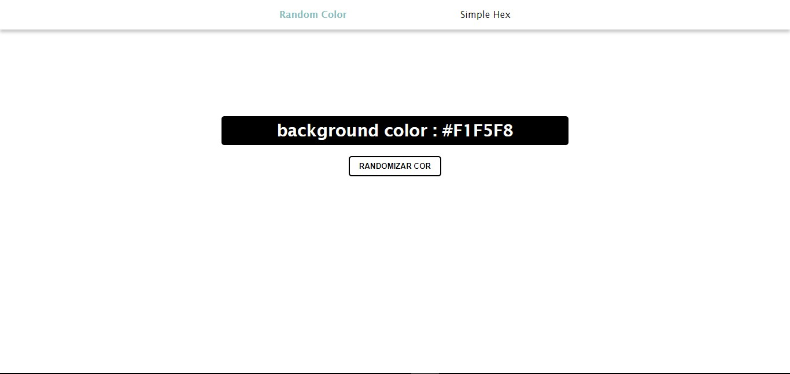

<h1> Random Color - Gerador de Cores Aleatórias em JavaScript </h1>

  Este é um simples projeto em JavaScript que gera uma cor aleatória em formato hexadecimal e a exibe na tela.

<h1>Como Funciona</h1>

- O código JavaScript gera um número aleatório entre (o maior valor possível para uma cor hexadecimal de 6 dígitos).
- Esse número aleatório é então convertido para a representação hexadecimal.
- A representação hexadecimal é exibida na tela como uma cor de fundo.

  
  

    
  

